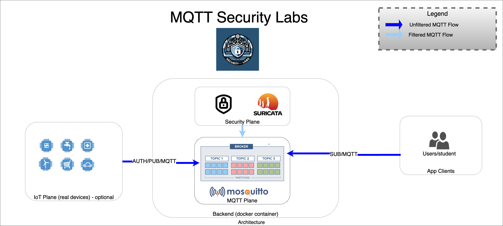

# MQTT-Security-Labs

Welcome to MQTT-Security-Labs, a hands-on training platform designed to enhance understanding and awareness of security vulnerabilities within MQTT protocols and brokers. This repository includes practical exercises and simulations for four common MQTT attack scenarios.

    

## Architecture components

    

## Attack Scenarios

1. **Sensible Topic Subscribing and Publishing**
   - This scenario demonstrates how attackers can subscribe to sensitive topics to intercept confidential data or publish malicious data.

2. **Information Grabber from Broker**
   - Explore how attackers can exploit vulnerabilities in MQTT brokers to extract sensitive information, compromising data privacy and integrity.

3. **Credentials Brute Force on Broker Topics**
   - This lab shows how attackers can perform brute force attacks to crack usernames and passwords, gaining unauthorized access to MQTT topics.

4. **Command and Control from Vulnerable Brokers**
   - Learn how compromised MQTT brokers can be used for command and control operations, leading to unauthorized control and manipulation of IoT devices.

## Getting Started

To get started with MQTT-Security-Labs:

1. Clone this repository.
2. Install any required tools and dependencies (listed in each scenario's folder).
3. Navigate to each scenario's dedicated folder for detailed instructions and setup guides.

## Prerequisites

- Basic understanding of MQTT protocol.
- Familiarity with network security concepts.
- Tools for simulating MQTT environments (e.g., Mosquitto broker, MQTT client applications).

## Contributing

We welcome contributions and suggestions! Please open an issue or submit a pull request with your improvements.

## License

This project is licensed under the MIT License - see the [LICENSE.md](LICENSE.md) file for details.

## Acknowledgments

- Special thanks to all contributors and the cybersecurity community for their insights and support in creating these labs.

---

Enjoy your hands-on journey through MQTT security with MQTT-Security-Labs!
